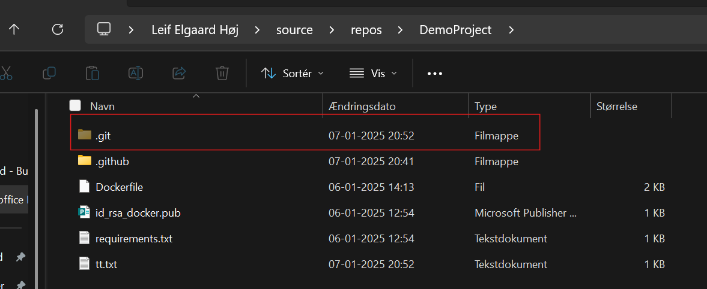
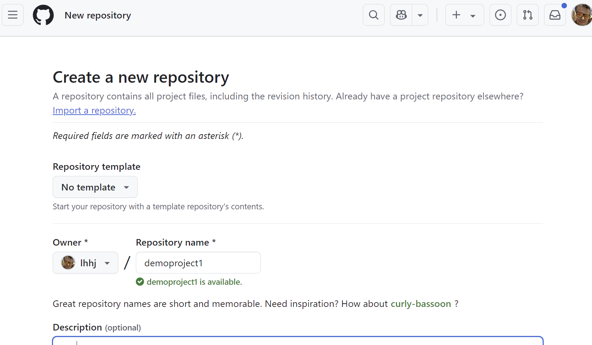
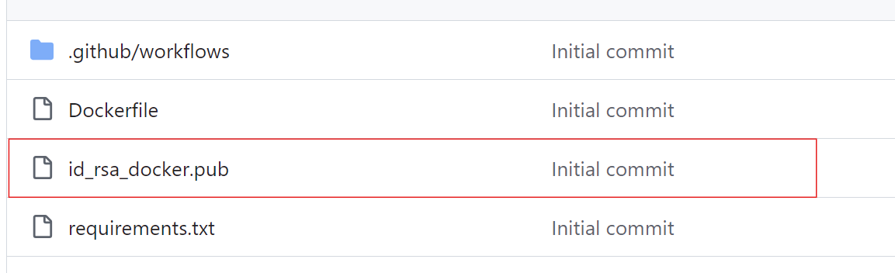
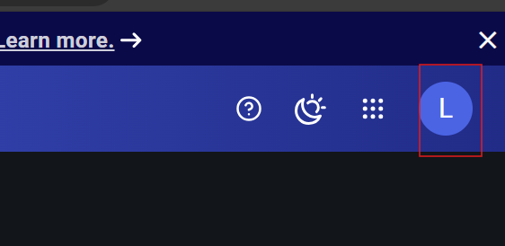
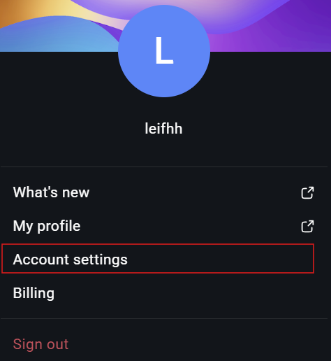
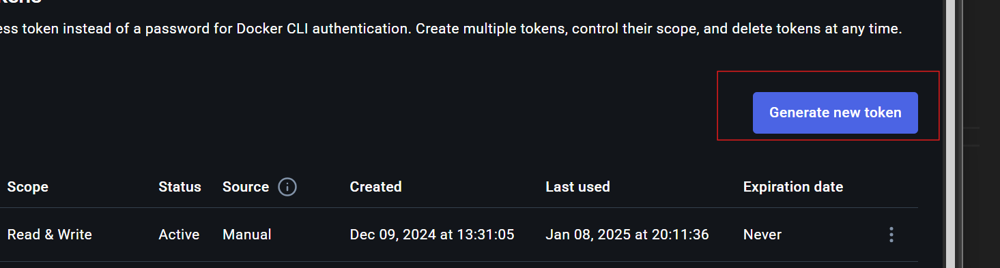
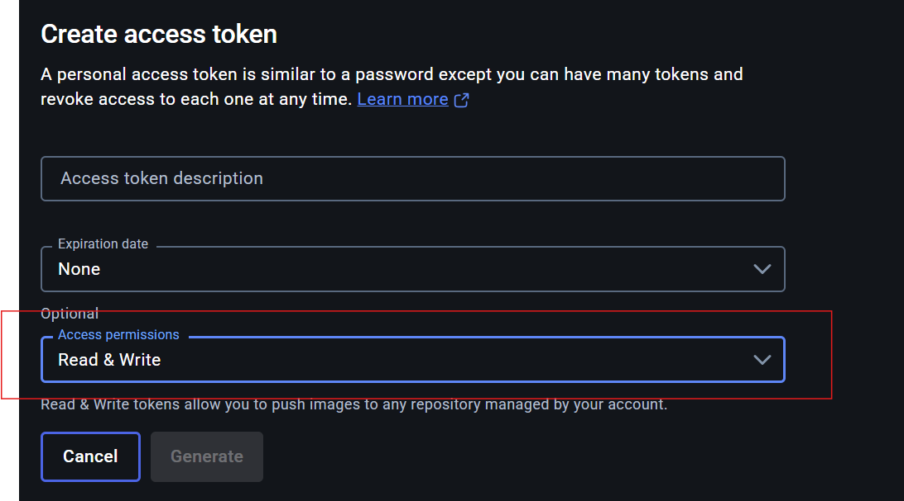
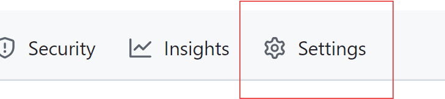
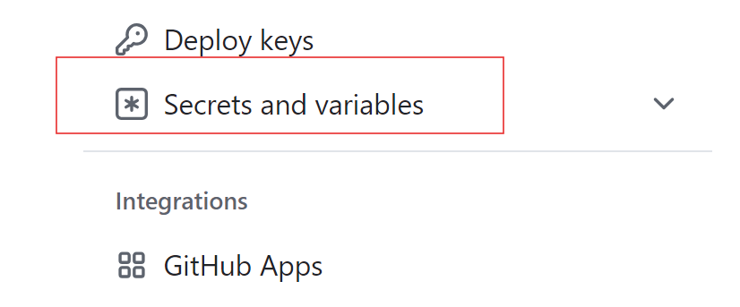
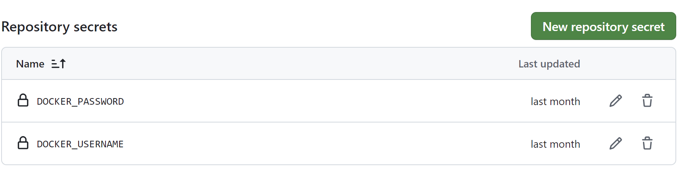

# Introduction
The **RFHPCManager** is a minimalistic approach to managing a high-performance computer (GPU server) for scientific computing work by multiple researchers. The goal of the manager is to ensure two key points:

1. Researchers do not accidentally break or introduce software that could disrupt other researchers’ work by installing incompatible software on the server.  
2. There is sufficient documentation to simplify sharing of data and virtual instances for peer review, making the process easier and more traceable.

This system is based on **Docker** and **Docker Compose**, which you can learn more about here: [https://www.docker.com/](https://www.docker.com/).

---

## Prerequisites
This guide assumes you have the following:

1. A **GitHub** account and the ability to create a private GitHub repository for your code.  
2. A **Docker** account.

---

## Step 1 – Clone the demo project
On your computer, open a command prompt (or terminal) and run:
```bash
git clone https://github.com/RFBerlin/DemoProject.git
```

## Step 2 remove .git folder 
navigate to the folder of the DemoProject and delete the hidden directory .git


## Step 3 rename folder 
Rename the folder **DemoProject** to ["your project name"] 
[!note]
>I will keep the proejct name DemoProject

## Step 4 create a github project in your own githup repo

On your private github site, create a new project


Once the project has been created you can open a cmd in yourDemoProject  and run the following commands

```bash
git init
git add.
git commit -m "initial commit"
git remote add origin HTTPS://github.com/USERNAME/REPONAME.git
git push -u origin main

```
 ## Step 5 Creating your own rsa key
 In order for you to access your own docker container, you need to generae a keyset and include the public part in your github repo
 the command to run to generate a ssh key could be 
 ```bash
 ssh-keygen -t rsa -b 4096 -C "your_email@example.com"
 ```

 ## Step 6 Replace the public key in github repo with newly created repo
 

 ## Docker and Docker Secret
 Docker and docker hub is a place where prebuild images can be stored and versioned.
 The images can also be shared which is the feature that we will use when images are build in a private github repo, and then shared.
 in order to do this you need to have a docker account and create a secret to be used in your github project. 
 the following assumes that you have a docker account

 ## Step 7 Create Docker Secrets
Login to docker.com and click on your profile in the right corner 


and navigate to account settings



In your account settings navigate to personal accestoken, and click generate new token

 

in the token setting make sure that your token has read write priviliges



Copy your token key to use in github

 ## Step 9 Update Secrets in github project
Navigate back to your  github project and click settings



and scrole down to Secrets and variables and click Actions



create two new screts like so :



with DOCKER_PASSWORD being your token from docker and DOCKER_USERNAME 

 ## Step 10 Create Docker container - GithubActions

Under actions in github, there should now be a container building and uploading to your docker repo

 ## Step 11 Update Docker compose file
 Contact leh@danofficeit.com for nows

 
